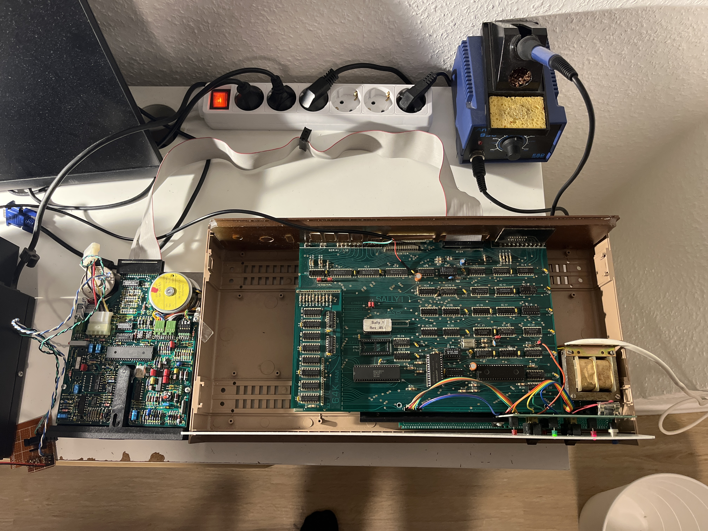
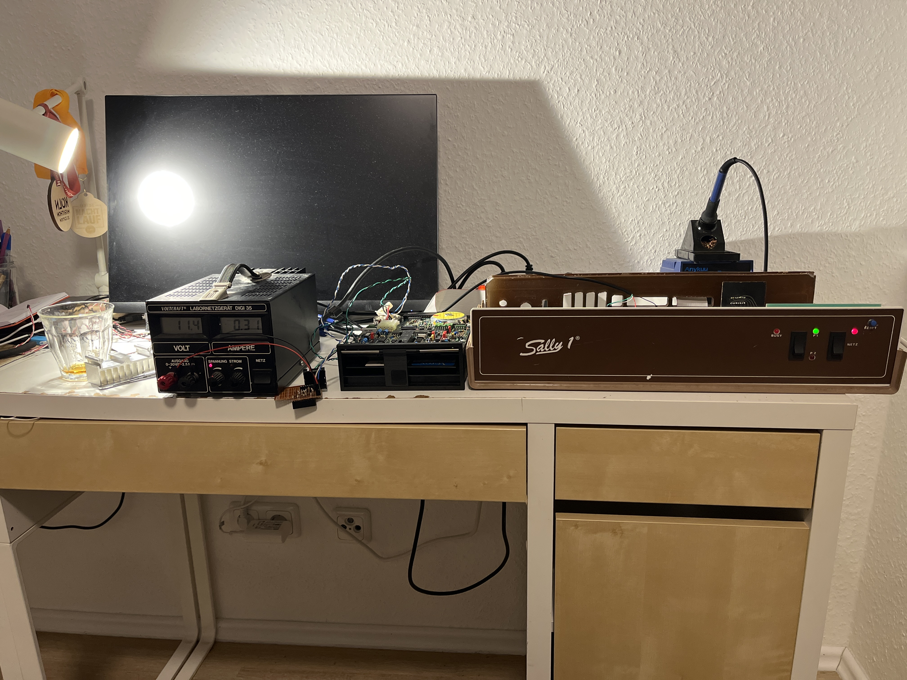
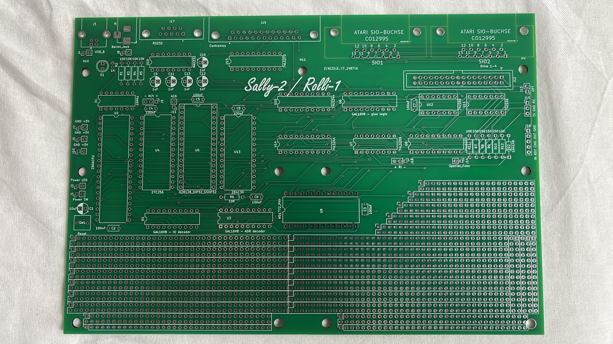
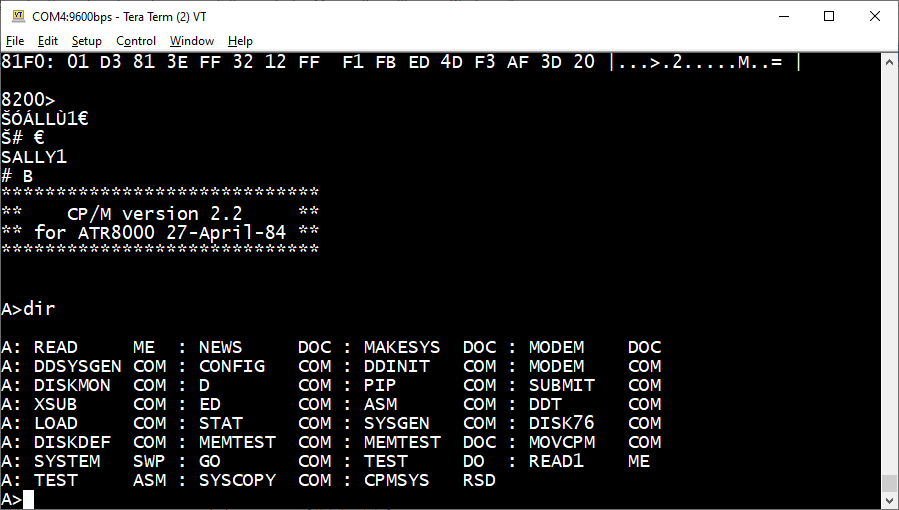

# Sally-2

An ATR8000 (https://www.atarimagazines.com/v3n4/ATR8000.php, http://atariki.krap.pl/index.php/ATR_8000) clone formerly made by SWP
and the Sally 1 by RSD (Rainer Storz Datentechnik)

Inspired by the repair of a Sally 1, which had been found in the attic, the
Atari-Bit-Byter-User-Club (www.abbuc.de) encouraged Marc and me to reproduce this lovely machine in a more compact way, 
though keeping a sort of retro-style.

We used 3 16V8 GALs in order to reduce chip count and replaced the WD1797 floppy-disc-controller by the more compact
WD1772 variant. Caveat: This chip is not designed for HD (500kbit/s) speed used by 3 1/2" and 8"-drives, although most 
can be overclocked to that speed. Only use WD1772PH-02-02 version and at your own risk.
If you can get hold on an AJAX chip used in e.g. ATARI STE, use this one as it is rated for HD and even ED speed (16/32 Mhz).

Build your own device: All required files and components can be found in the release drawer 
https://www.vretrodesign.com/products/vr177x-wd1770-wd172-vl1772-replacement

You also could become an ABBUC member and buy a DIY kit at https://www.abbuc.de
Join the illustrous community and take part in conventions and discussions.

After some testing and debugging, the vRetro VR177x FDC replacement can now be recommended for use with this interface.
See https://www.vretrodesign.com/products/vr177x-wd1770-wd172-vl1772-replacement

# Key features:

- Operates either as standalone CP/M system or versatile ATARI 8-bit interface (up to 4 floppies, Centronics, RS232)
- Z80-CPU at 4Mhz
- 128k static RAM (64k usable)
- 8k EPROM, use any 8 / 16 / 32 / 64k device (burn sally2.hex at $8000)
- WD1772 FDC (or AJAX FDC or VR177x)
- Z80-CTC timer/counter 

Additionally we have added:

- 60.000 baud high speed SIO (Pokey divisor 8, drive responds to the "Get Speed Byte" command '?')
- Track buffer
- HD-support for 3 1/2" disks (ca. 1MB). (Format is same as 8", 2 sides, 77 tracks, 26 sectors/track, 256 bytes per sector)

# ToDo:

- read/write 512-bytes (MS-DOS) sectors for my Atari FAT-16 DOS 
- add SD-card?

Original Sally 1 repaired (5 ICs were out of order) and tested with a 40Trk single sides drive.

First version of Sally 2 PCB and a case

ATR8000 CP/M running on Sally 1 (todo: Add picture of the Sally CP/M version, which is apart from the messages identical to the ATR8000) 

# final product ready as of October 2025

# further progress as of April 2025:

- Marc has completed a new manually routed PCB and 3 supporting PCBs for swicthes and connectors
- ATARI can read/write 3 1/2 HD disks formtted like 8"-disks (26sec x 77 trks x 2 sides = ca. 1MB)
  The challange was to allow for HD even for 300 rpm drives, instead of 360rom used by 8" and 5 1/4" drives.
- A full blown FAT-12 DOS for the ATARI is close to be finished, some more testing and minor additional features required/appreciated
- ABBUC now owns a Bumbu X1-carbon 3D printer, which has immediately been used to dress Sally-2 appropirately.

First try, all-in-one print, label and case

Second try, separate label in higher quality, also changed beige to white

