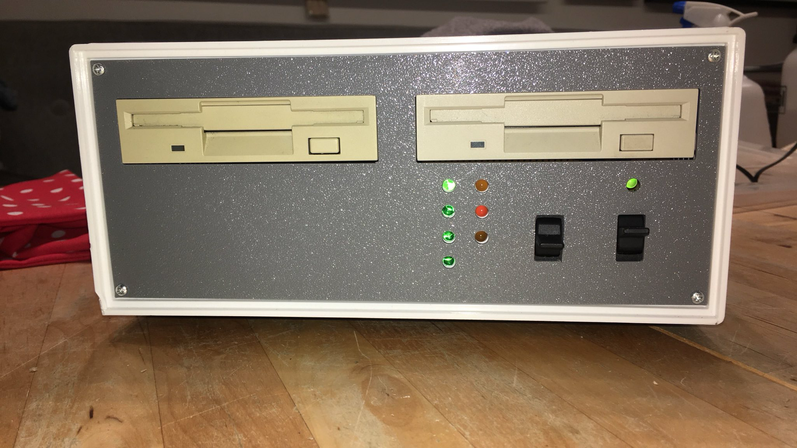

# Sally-2

An ATR8000 (https://www.atarimagazines.com/v3n4/ATR8000.php) clone formerly made by SWP and the Sally 1 by RSD

Inspired by the repair of a Sally 1, which was found in the attic, the
Atari-Bit-Byter-User-Club (www.abbuc.de) encouraged Marc and me to reproduce this lovely machine in a more compact way, 
though keeping a sort of retro-style.

We used 3 GAL 16V8 in order to reduce chip count and preplaced the WD1797 floppy-disc-controller by the more compact
WD1772 variant. Caveat: This chip is not designed for HD (500kbit/s) speed used by 3 1/2" and 8"-drives, although most 
can be overclocked to that speed. Only use WD1772-PH-02-02 version and at your own risk.

#Key feaures:

- Operates as standalone CP/M system or versatile ATARI 8-bit interface (up to 4 floppies, Centronics, RS232)
- Z80-CPU at 4Mhz
- 128k static RAM (64k usable)
- 8k EPROM
- WD1772 FDC
- Z80-CTC timer/counter 

Additionally we have added:

- 60.000 baud high speed SIO (Pokey divisor 8)
- Track buffer
- HD-support for 3 1/2" disks (ca. 1MB). (Format is same as 8", 2 sides, 77 tracks, 26 sectors/track, 256 bytes per sector)

#ToDo:

- another(better) case and Shugart connector at the back.
- PCB-layout for other case
- improve 3 1/2" HD format
- read/write 512-bytes (MS-DOS) sectors for my Atari FAT-16 DOS 
- add SD-card?

